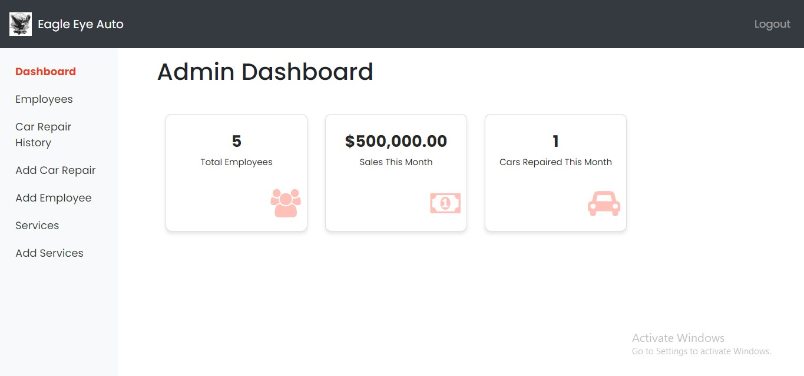
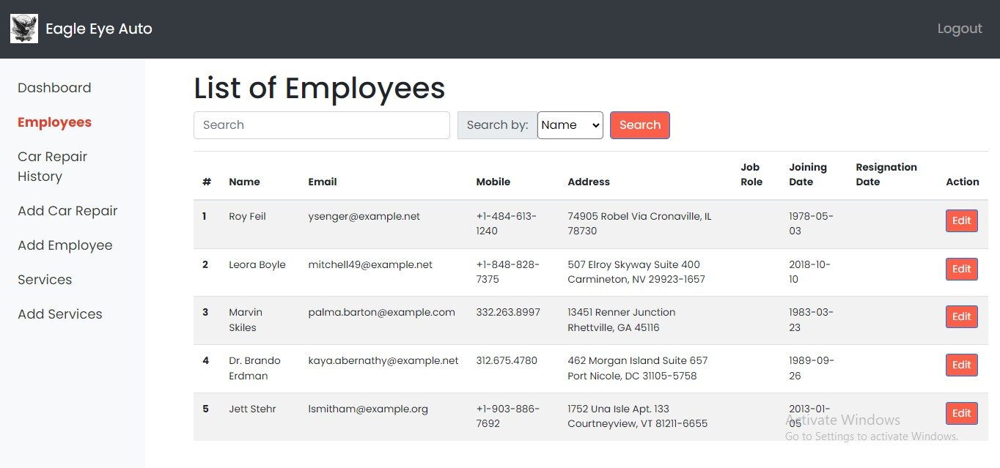

# Eagle Eye Auto
[Visit the Hosted Website](http://www.lovepreet-g.com)

## Description

Eagle Eye Auto is a comprehensive website designed for a car mechanic shop, aiming to provide users with detailed information about the shop's services, pricing, and customer reviews. Additionally, it facilitates communication between users and the admin through a contact form and allows the admin to manage website content efficiently. Moreover, it features a management system enabling the admin to efficiently oversee employee details and log in the repair details of cars serviced at the shop.

## Target Audience

The target audience includes car owners seeking mechanical services and repairs in the local area serviced by the mechanic shop.

## Purpose

Eagle Eye Auto aims to establish an online presence for the mechanic shop, enhancing visibility, building trust through user reviews, and streamlining communication with potential customers.

## Features

### Must Have

- Service Showcase
- Contact Form
- Employee Management
- Car Repair History

### Should Have

- Search Car Repair History By VIN

### Nice to Have

- User Reviews
- User Profile
- Employee Shift Schedule
- Employee Login

## Technology Stack

### Backend Framework
- PHP Laravel

### Database
- MySQL

### Frontend
- HTML
- CSS
- JavaScript

### Third-party APIs
- Google Maps API

## Hosting
- The application is hosted on Amazon Web Services (AWS) to ensure high availability and scalability.

## Contributors
- [Lovepreet Singh](https://github.com/Lovepreet-G)

## Screenshots

### Homepage

### Admin Dashboard

### Employee List

### Car History List

### Add Employee

### Add Car Detail

### Services

### Add Service

These screenshots provide a visual representation of the key sections of the Eagle Eye Auto website, showcasing the user interface and functionality available to both users and administrators.

---
